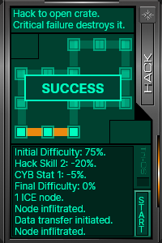

# SS2

> A .NET 5 implementation of the **hacking mini game** from **ss2** using **.NET** and **Avalonia UI** / **WPF**.  
> The mini game from the classic System Shock 2 itself is like *tic-tac-toc/connect-four*

## Project Structure

[SS2.Core](SS2.Core) *Essential game logic and models*  
[SS2.Core.Test](SS2.Core.Test) *Testing*  
[SS2.Avalonia](SS2.AvaloniaUI) *Cross-platform implementation using [Avalonia UI](https://avaloniaui.net/)*   
[SS2.WPF](SS2.WPF) *Experimental WPF/WinForms implementation*  

## Screenshot

## Download

*TBA*

<!-- 
* [Windows x64]()
* [Linux x64]()
* [macOS x64]()
-->

## License

[GNU GPLv3](LICENSE)